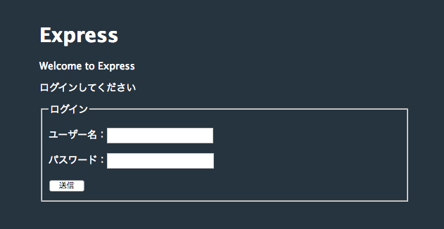
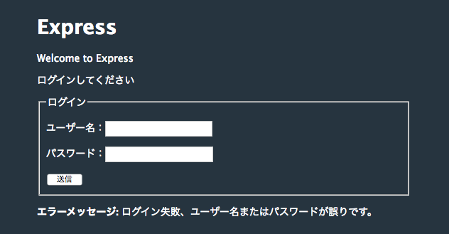

# myapp
Node.js express application study

**環境**

~~~
myapp$ node --version
v4.4.7
~~~

**インストール**

~~~
myapp$ npm install
~~~

**実行**

~~~
myapp$ npm start
~~~

**アクセス**

アドレスは、ドメイン名、または IPアドレス にポート 3000 番をアクセスする。
http://hostname:3000/

サーバーのアドレスにアクセスした時の画面

パスワードを間違えてログインに失敗して、フラッシュのエラーメッセージ表示

